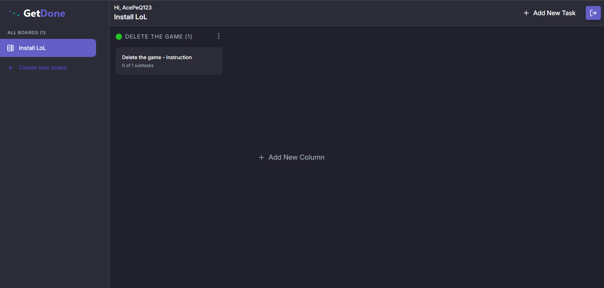

# GetDone

GetDone is a full-stack task and project management application inspired by Kanban-style workflows. It allows users to create boards, organize work into columns, and manage tasks with priorities and subtasks.

The project was built as a learning and portfolio application, with a separate React frontend and Node.js/Express backend.

## Live Demo

> https://getdone-fdl9.onrender.com/

## Preview



## Features

- User registration and login
- JWT-based authentication using HTTP-only cookies
- Protected board, column, and task endpoints
- Create and manage multiple boards
- Create, edit, and delete columns
- Create, update, and delete tasks
- Tasks with descriptions, priorities, and subtasks
- Responsive interface for different screen sizes
- Toast notifications for user feedback
- Server-state handling with TanStack Query
- Frontend state management with Zustand
- Modular frontend structure divided into features, pages, components, hooks, stores, API helpers, and utilities

## Tech Stack

### Frontend

- React
- TypeScript
- Vite
- React Router
- TanStack React Query
- Zustand
- React Hook Form
- React Toastify
- Framer Motion / Motion
- CSS Modules
- Lucide React

### Backend

- Node.js
- Express
- TypeScript
- MongoDB
- Mongoose
- JWT
- bcrypt
- cookie-parser
- CORS
- dotenv

## Project Structure

```txt
GetDone/
├── backend/
│   ├── src/
│   │   ├── configs/
│   │   ├── controllers/
│   │   ├── middlewares/
│   │   ├── models/
│   │   ├── routes/
│   │   ├── utils/
│   │   └── server.ts
│   ├── package.json
│   └── tsconfig.json
│
├── frontend/
│   ├── public/
│   ├── src/
│   │   ├── api/
│   │   ├── assets/
│   │   ├── components/
│   │   ├── features/
│   │   │   ├── Auth/
│   │   │   ├── Boards/
│   │   │   ├── Columns/
│   │   │   └── Tasks/
│   │   ├── hooks/
│   │   ├── pages/
│   │   ├── stores/
│   │   ├── utils/
│   │   ├── App.tsx
│   │   ├── index.css
│   │   └── main.tsx
│   ├── package.json
│   └── vite.config.ts
│
└── README.md
```

## Getting Started

### Prerequisites

Make sure you have installed:

- Node.js
- npm
- MongoDB database, local or hosted

## Installation

Clone the repository:

```bash
git clone https://github.com/AcePeQ/GetDone.git
cd GetDone
```

## Backend Setup

Go to the backend folder:

```bash
cd backend
npm install
```

Create a `.env` file inside the `backend` folder:

```env
PORT=5000
MONGODB_URL=your_mongodb_connection_string
JWT_SECRET=your_jwt_secret
NODE_ENV=development
```

Run the backend in development mode:

```bash
npm run dev
```

Build the backend:

```bash
npm run build
```

Start the compiled backend:

```bash
npm start
```

## Frontend Setup

Go to the frontend folder:

```bash
cd frontend
npm install
```

Create a `.env` file inside the `frontend` folder:

```env
VITE_API_BASE_URL=http://localhost:5000
```

Run the frontend in development mode:

```bash
npm run dev
```

Build the frontend:

```bash
npm run build
```

Preview the production build:

```bash
npm run preview
```

## Available Scripts

### Backend

```bash
npm run dev        # Start backend in development mode
npm run build      # Compile TypeScript
npm start          # Start compiled backend
npm run startProd  # Build and start backend
npm run lint       # Run ESLint for backend files
```

### Frontend

```bash
npm run dev      # Start Vite development server
npm run build    # Build frontend for production
npm run preview  # Preview production build
npm run lint     # Run ESLint
```

## API Overview

### Authentication

```txt
POST /api/auth/register
POST /api/auth/login
POST /api/auth/logout
```

### Boards

```txt
GET  /api/board/boards
POST /api/board/userBoard
```

### Columns

```txt
POST   /api/column/column
PUT    /api/column/column
DELETE /api/column/column
```

### Tasks

```txt
POST   /api/task/task
PUT    /api/task/task
DELETE /api/task/task
```

## Data Models

The backend uses MongoDB collections for:

- Users
- Boards
- Columns
- Tasks
- Subtasks embedded inside tasks

A board belongs to a user. A column belongs to a board. A task belongs to a column.

## Environment Variables

### Backend

| Variable | Description |
|---|---|
| `PORT` | Backend server port |
| `MONGODB_URL` | MongoDB connection string |
| `JWT_SECRET` | Secret key used to sign JWT tokens |
| `NODE_ENV` | Application environment, for example `development` or `production` |

### Frontend

| Variable | Description |
|---|---|
| `VITE_API_BASE_URL` | Base URL of the backend API |

## Possible Improvements

- Add drag-and-drop task movement between columns
- Add board editing and board deletion
- Add task editing for title, description, and priority
- Add better loading and empty states
- Add unit and integration tests
- Add a public demo link and screenshots
- Improve API error handling
- Add refresh-token or session validation flow
- Add deployment documentation

## Author

Created by [AcePeQ](https://github.com/AcePeQ).
